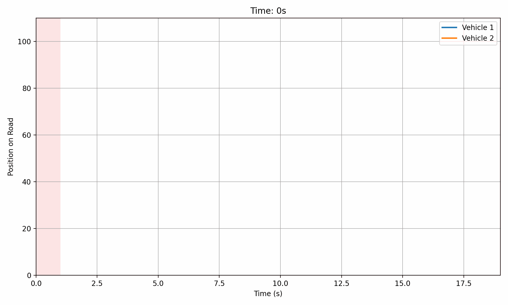

# Smart Traffic Flow Simulator 🚦🚗

A cross-language project using **C++** for high-performance traffic simulation and **Python** for visualization, analytics, and ML extension.

## 🚀 Features
- Real-time vehicle simulation with lane-based traffic model (C++)
- Dynamic traffic lights with adjustable intervals
- CSV-based logging and data bridge between C++ and Python
- Python dashboard for plotting and animated simulation
- GIF + video export for presentations and portfolio

## 📊 Animated Traffic Simulation


## 📁 Tech Stack
- `C++` — Simulation engine
- `Python (pandas, matplotlib)` — Data processing + visualization
- `matplotlib.animation` — GIF/video rendering

## 📄 How to Run
```bash
# Compile C++ and generate data
cd cpp_simulation
clang++ -std=c++11 main.cpp Vehicle.cpp Road.cpp TrafficLight.cpp -o traffic_sim
./traffic_sim

# Visualize in Python
cd ../python_dashboard
python dashboard.py       # for static plot
python animation.py       # for animation / gif
